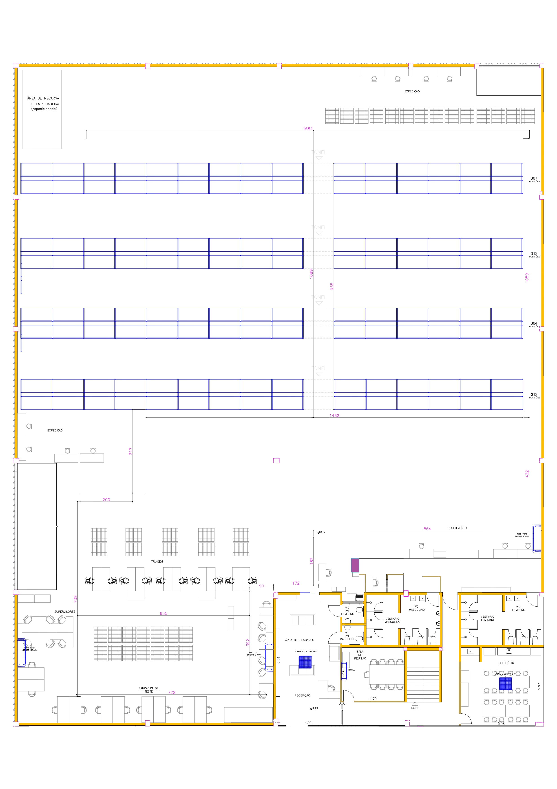

# Duas Barras · Layout 3D

Visualização 3D interativa do barracão de logística **Duas Barras**, montada a partir da planta suspensa
"Duas Barras Arquitetônico – Caminho Seguro 2". Roda como app da Web no **Google Apps Script** e também como
página HTML única. Um script do **Blender** gera o mesmo modelo para renders, vídeos ou exportação `.glb`.



## O que o modelo mostra

- **Armazenagem**: 4 fileiras de porta-paletes duplo (5 níveis, 1.235 posições conforme a planta), com
  túnel de pedestres no meio.
- **Caminho seguro**: rota de pedestres demarcada no piso, conforme as linhas da planta, com um pedestre
  percorrendo o trajeto.
- **Áreas**: recebimento, expedição, Neia, triagem, paletes de apoio, bancadas de teste,
  supervisores e recarga de empilhadeiras.
- **Docas**: Doca 1 (parede oeste) e Doca 2 (canto nordeste), cercadas com tela e com porta de enrolar.
- **Escritórios**: recepção e descanso, sala de reunião, escada, vestiários, WC PNE e refeitório.
- **Empilhadeiras ilustrativas** circulando nos corredores entre fileiras, separadas do caminho seguro.

O acabamento visual segue fotos da operação: piso de concreto, paredes de concreto pré-moldado com
venezianas no alto (visíveis com "Paredes em altura real"), fita amarela demarcando áreas e paletes, paletes
plásticos azuis, mesas de tampo preto com monitores, bancadas de teste numeradas 01–04 com pórticos de
iluminação, postos numerados com câmera e gaiolas metálicas prata e rosa (1,80 × 0,80 m) na triagem, TV dos supervisores, climatizador, cadeiras pretas e
equipe de uniforme azul ou preto.

As texturas são geradas no próprio navegador (sem arquivos externos, então funcionam no Apps Script): concreto
polido com manchas, fissuras e juntas serradas; painéis de concreto com escorridos e insertos de içamento;
papelão kraft com fita e etiqueta de código de barras; tábuas de madeira dos paletes; paletes plásticos vazados;
montantes perfurados; tampos laminados; telas de sistema nos monitores; porcelanato nos escritórios e fita de
piso com desgaste. As pessoas são humanoides articulados (em pé trabalhando, sentadas e caminhando, com a
passada animada no percurso do caminho seguro), com tons de pele, cabelo e calças variados. No Blender, as
mesmas texturas são feitas com nós de ruído procedural e as pessoas com a mesma anatomia simplificada.

Interações: girar, aproximar e arrastar com mouse ou toque; vistas prontas (Visão geral, Planta, Armazenagem,
Escritórios); **Percorrer caminho seguro**, um passeio guiado em terceira pessoa pelo trajeto; camadas liga/desliga;
dica ao passar o mouse; clique para focar numa área. Segue o tema claro/escuro do sistema.

## Estrutura

```
apps-script/
  Code.gs          doGet() e include(): serve a página no Apps Script
  Index.html       interface (estilos, painéis, botões)
  Layout.html      DADOS da planta (JSON): paredes, fileiras, áreas, móveis, caminho seguro
  Viewer.html      visualizador 3D (Three.js r147)
  appsscript.json  manifesto do projeto
blender/
  gerar_modelo.py  monta a mesma cena no Blender a partir de Layout.html
tools/
  build_standalone.py  junta os arquivos em dist/duas-barras-3d.html
dist/
  duas-barras-3d.html  versão de arquivo único (abre direto no navegador)
docs/
  planta-referencia.jpg  imagem da planta usada para tirar as coordenadas
```

`Layout.html` é a única fonte dos dados: o visualizador web e o script do Blender leem o mesmo JSON.

## Publicar no Google Apps Script

1. Acesse <https://script.google.com> e crie um **Novo projeto**.
2. Renomeie `Código.gs` para `Code.gs` e cole o conteúdo de `apps-script/Code.gs`.
3. Crie três arquivos HTML (**+ › HTML**) com os nomes exatos `Index`, `Layout` e `Viewer` e cole o conteúdo
   dos arquivos correspondentes.
4. **Implantar › Nova implantação › Tipo: App da Web**. Em "Quem pode acessar", escolha quem vai ver a
   demonstração (por exemplo, "Qualquer pessoa com uma Conta do Google" ou "Qualquer pessoa").
5. Abra a URL `/exec` gerada.

Pelo terminal, com o [clasp](https://github.com/google/clasp): `clasp create --type webapp --rootDir apps-script`,
depois `clasp push` e `clasp deploy`.

A página carrega o Three.js pelo CDN `cdn.jsdelivr.net` e as fontes do Google Fonts, então quem abre precisa
de acesso à internet.

## Abrir sem o Apps Script

Abra `dist/duas-barras-3d.html` no navegador. Depois de editar algum arquivo em `apps-script/`, gere de novo com:

```bash
python3 tools/build_standalone.py
```

## Gerar no Blender

```bash
blender --background --python blender/gerar_modelo.py -- --blend saida/duas-barras.blend --glb saida/duas-barras.glb
```

- `--paredes-altas` sobe as paredes externas para 10 m (o padrão é o corte a 2,4 m, que deixa ver o interior).
- Dentro do Blender: abra o script no editor de texto e clique em **Run Script**. Se ele não encontrar o
  `Layout.html`, preencha `LAYOUT_PATH` no início do arquivo.
- A cena vem organizada em coleções (Estrutura, Porta-paletes, Paletes, Caminho seguro, Áreas, Escritórios,
  Mobiliário, Pessoas e empilhadeiras), com câmera e sol posicionados.

Testado com o módulo `bpy` 4.2 (exportação `.blend`/`.glb` e render Cycles).

## Escala e premissas

A planta não traz escala, então as medidas foram estimadas a partir dela mesma:

| Referência na planta | Medida na imagem | Resultado |
| --- | --- | --- |
| Grade de pilares | 587 px entre eixos | 10 m entre pilares |
| Paletes desenhados | ~60 × 71 px | 1,0 × 1,2 m (PBR) |
| Cotas do escritório (4,79 / 4,06 / 9,91 m) | batem com 58,8 px/m | confirma a escala |

Com isso o barracão fica com **≈ 40 × 50 m (≈ 2.000 m²)**, e a escala está em `meta.pxPerMeter` em `Layout.html`.

As cotas em magenta ao longo do caminho seguro (1684, 1432, 1089…) **não batem** com essa escala: medidas na
imagem, elas dão cerca do dobro do valor escrito. Por isso não usamos esses números no modelo. Vale confirmar com
quem fez a planta.

Alturas adotadas (não constam na planta e podem ser ajustadas em `Layout.html`):

- pé-direito do galpão: 10 m; paredes do escritório: 3 m;
- porta-paletes: 7,8 m, níveis a 0 / 1,6 / 3,2 / 4,8 / 6,4 m. Com 5 níveis e 2 paletes por vão o total dá
  ~300 posições por fileira, próximo das 304–312 da planta;
- túnel de pedestres: livre até o 4º nível (4,8 m);
- ocupação dos paletes nas estantes: 78% (ilustrativa).

As duas áreas cercadas sem nome na planta são as docas: a faixa lateral oeste é a Doca 1 e o canto nordeste,
a Doca 2. A posição das portas de enrolar, a do climatizador e a da TV dos supervisores foram estimadas pelas
fotos.

## Ajustar o layout

Tudo está em `apps-script/Layout.html`, em **pixels da imagem `docs/planta-referencia.jpg`** (2480 × 3509):

- `walls`: segmentos `[x1, y1, x2, y2]` (perímetro, escritório, divisórias);
- `racks`: níveis, altura, divisões dos vãos e as 4 fileiras (`positions` é o número mostrado);
- `zones` e `rooms`: retângulos `[x0, y0, x1, y1]`, com nome e descrição da dica;
- `path.segments`: polilinhas do caminho seguro; `path.tour` é a ordem do passeio guiado;
- `furniture` (`worktable` = tampo preto; `bench` com `num` = bancada de teste numerada; `cooler` = climatizador),
  `floorPallets` (`load`: `tall` ou `mixed`), `cages` (gaiolas da triagem), `posts` (postos numerados da
  triagem), `tvs`, `chairs`,
  `seated` (pessoas sentadas), `people` (em pé), `forklifts`;
- a porta de enrolar de uma doca é o campo `door` da área (segmento sobre a parede externa).

Para medir um ponto novo, abra a imagem num editor que mostre a posição do cursor em pixels.
