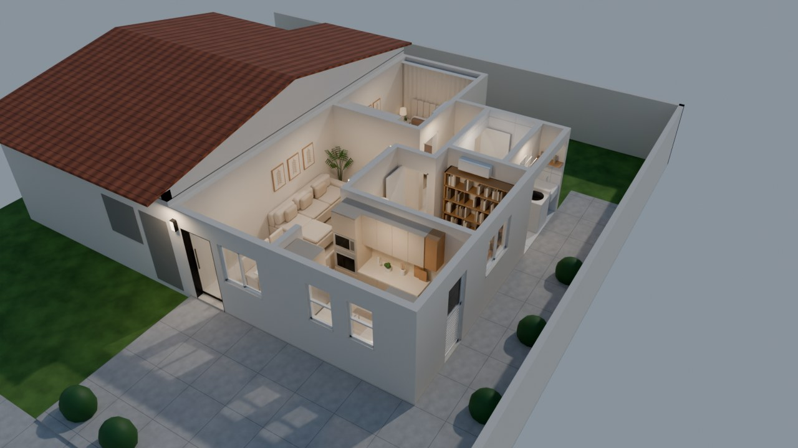

# Casa Jardim Primavera · 3D

Visualização 3D da casa **Jardim Primavera, 2 dormitórios, lado esquerdo**, montada no **Blender** a partir da
planta em PDF (escala 1:75) e das fotos de referência dos cômodos. O modelo roda como app da Web no
**Google Apps Script** e também como página HTML única.



## O que o modelo mostra

- **Paredes da planta**: os polígonos de alvenaria estrutural foram copiados dos vetores do PDF e convertidos
  para metros (1 ponto do PDF = 26,46 mm na escala 1:75). As cotas batem com a planta: sala 2,60 × 5,70 m,
  dormitório 01 2,65 × 3,80 m, cozinha 3,20 × 2,40 m, banho 1,40 × 2,26 m.
- **Porta da sala em vidro**: vidro temperado de correr, perfil de alumínio preto e trilho aparente pelo lado
  de dentro. O botão **Abrir porta** faz a folha correr.
- **Cômodos seguindo as fotos**:
  - sala: sofá em L bege, painel ripado com TV e LED, rack suspenso, três quadros de folhas, palmeira e mesa
    de jantar branca com 6 cadeiras estofadas;
  - cozinha: marcenaria bege fosca, bancada creme, cuba inox com torneira gourmet, cooktop, geladeira inox,
    torre com forno e micro-ondas, LED sob os aéreos, nichos de madeira, passadeira e a porta de alumínio
    branca com vidro e venezianas;
  - dormitório 01: cama com cabeceira estofada em gomos, criados-mudos com abajur, cortina do piso ao teto
    com sanca e LED, quadros, cômoda, guarda-roupa e tapete;
  - dormitório 02 como **home office**: escrivaninha sob a janela, cadeira, estante com livros, sofá-cama,
    quadros e luminária de piso;
  - banho social: revestimento branco, bancada preta suspensa com cuba de apoio, espelho com luz no teto,
    bacia com caixa acoplada e box de vidro;
  - área de serviço com tanque e máquina de lavar.
- **Telhado** cerâmico em duas águas, **teto** com sancas de gesso e plafons, terreno com calçada e a casa
  geminada vizinha (só a volumetria).

No visualizador: vistas prontas (visão geral, planta, fachada e cada cômodo), **Passeio** automático,
**Dia/Noite**, camadas liga/desliga (paredes cortadas, móveis, teto, telhado, nomes dos cômodos, vizinha e
terreno) e clique no nome do cômodo para entrar nele.

## Estrutura

```
apps-script/
  Code.gs          doGet() e include(): serve a página no Apps Script
  Index.html       interface (estilos, painéis, botões)
  Viewer.html      visualizador 3D (Three.js r147)
  Modelo.html      modelo 3D do Blender (.glb em gzip + base64), gerado por tools/build.py
  appsscript.json  manifesto do projeto
blender/
  gerar_casa.py    monta a casa no Blender, exporta o .glb e faz os renders
tools/
  build.py         empacota o .glb em Modelo.html e gera dist/casa-3d.html
dist/
  casa-3d.html     versão de arquivo único (abre direto no navegador)
renders/           imagens renderizadas no Cycles
docs/
  planta-arquitetura.jpg  página da planta de arquitetura usada como base
```

## Publicar no Google Apps Script

1. Acesse <https://script.google.com> e crie um **Novo projeto**.
2. Renomeie `Código.gs` para `Code.gs` e cole o conteúdo de `apps-script/Code.gs`.
3. Crie três arquivos HTML (**+ › HTML**) com os nomes exatos `Index`, `Viewer` e `Modelo` e cole o conteúdo
   dos arquivos correspondentes. O `Modelo.html` é grande (cerca de 560 KB): cole tudo, sem cortar.
4. Em **Configurações do projeto**, marque "Mostrar o arquivo de manifesto appsscript.json" e cole o conteúdo
   de `apps-script/appsscript.json` (opcional: o padrão já funciona).
5. **Implantar › Nova implantação › Tipo: App da Web**. Em "Quem pode acessar", escolha quem vai ver a casa
   (por exemplo, "Qualquer pessoa com uma Conta do Google" ou "Qualquer pessoa").
6. Abra a URL `/exec` gerada.

Pelo terminal, com o [clasp](https://github.com/google/clasp): `clasp create --type webapp --rootDir apps-script`,
depois `clasp push` e `clasp deploy`.

A página carrega o Three.js pelo CDN `cdn.jsdelivr.net` e as fontes do Google Fonts, então quem abre precisa de
acesso à internet. O modelo vem compactado e é descompactado no navegador (Chrome, Edge, Firefox e Safari
recentes).

## Gerar de novo pelo Blender

```bash
# modelo para o visualizador + arquivo .blend
blender --background --python blender/gerar_casa.py -- --glb saida/casa.glb --blend saida/casa.blend
python3 tools/build.py            # atualiza apps-script/Modelo.html e dist/casa-3d.html

# renders no Cycles (todas as vistas, ou só algumas com --cams)
blender --background --python blender/gerar_casa.py -- --render renders --samples 64 --res 1280x720
```

Também funciona com o módulo `bpy` do Python (`pip install bpy`), trocando `blender --background --python X --`
por `python3 X`. Testado com o Blender 5.2. Dentro do Blender, abra o script no editor de texto e clique em
**Run Script** para montar a cena com coleções por grupo (Estrutura, Esquadrias, Teto, Telhado, móveis de cada
cômodo), luzes e câmeras de cada vista.

## Premissas

A planta não traz alturas nem acabamentos, então foi adotado:

| Item | Valor |
| --- | --- |
| Pé-direito | 2,60 m (laje de 12 cm, como na planta de lajes) |
| Portas | 2,10 m de altura; internas de 0,80 m, abertas como desenhado na planta |
| Janelas dos quartos | peitoril 1,10 m, altura 1,00 m, de correr |
| Janela da sala | peitoril 1,00 m, altura 1,10 m, de correr |
| Janelas da cozinha | maxim-ar, peitoril 1,05 m |
| Basculante do banho | peitoril 1,50 m |
| Telhado | duas águas, cumeeira a 3,80 m, inclinação de 18%, beirais da projeção da cobertura |

**Porta de vidro:** o vão da porta da sala na planta tem 0,90 m e fica em alvenaria estrutural, que não pode
ser alargada (aviso da própria planta). Por isso a porta de vidro foi feita com **uma folha de 1,00 m** que
corre por dentro, sobre o trecho de parede e parte da janela ao lado. Duas folhas nesse vão deixariam só
0,45 m de passagem.

A área de serviço fica aberta para o corredor lateral, coberta pelo telhado, como na planta.
